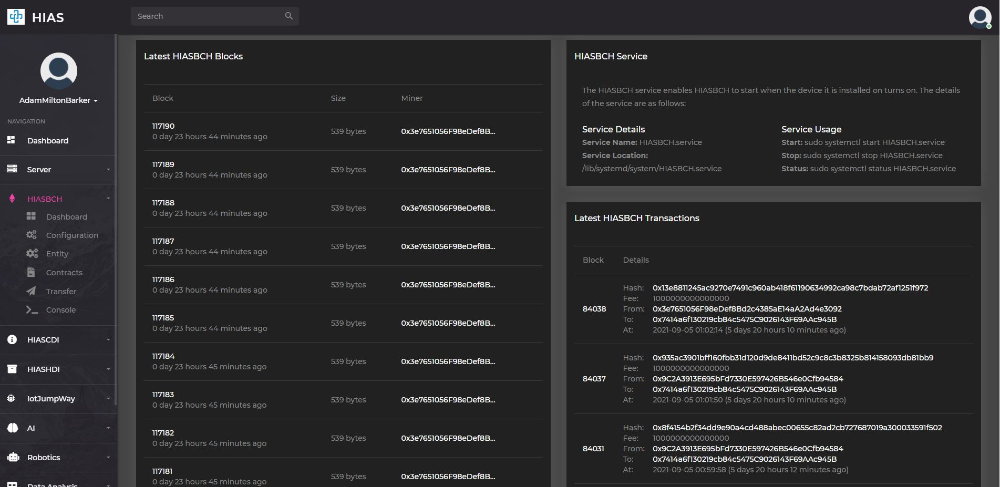
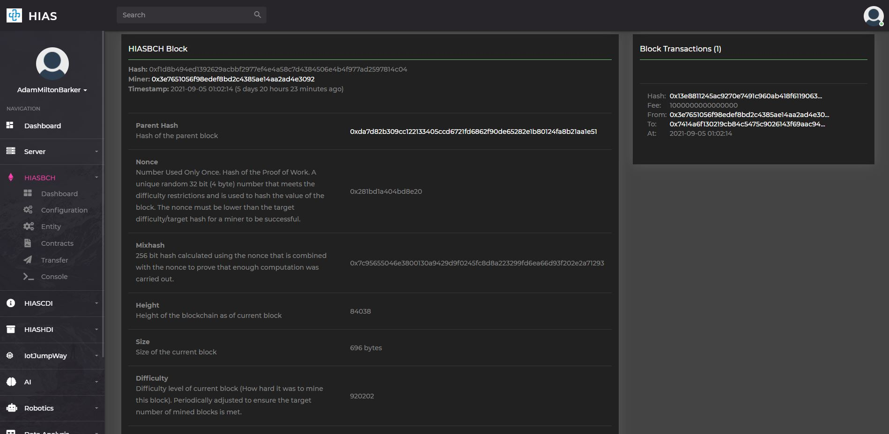
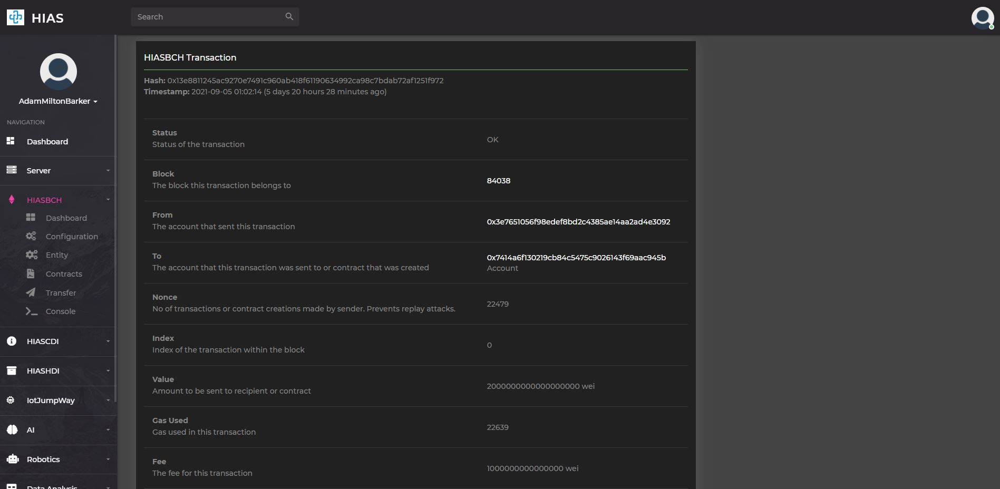
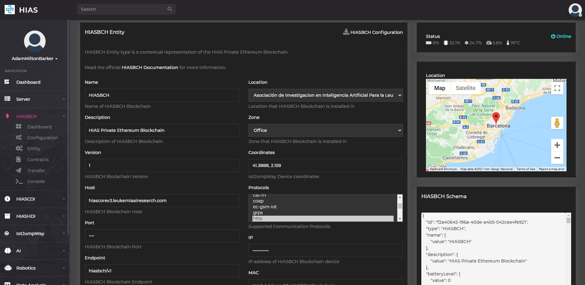
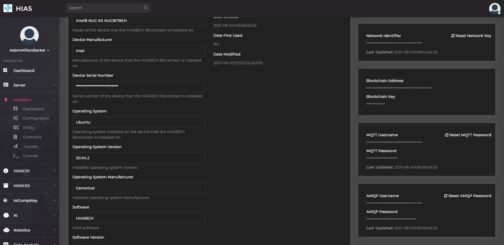
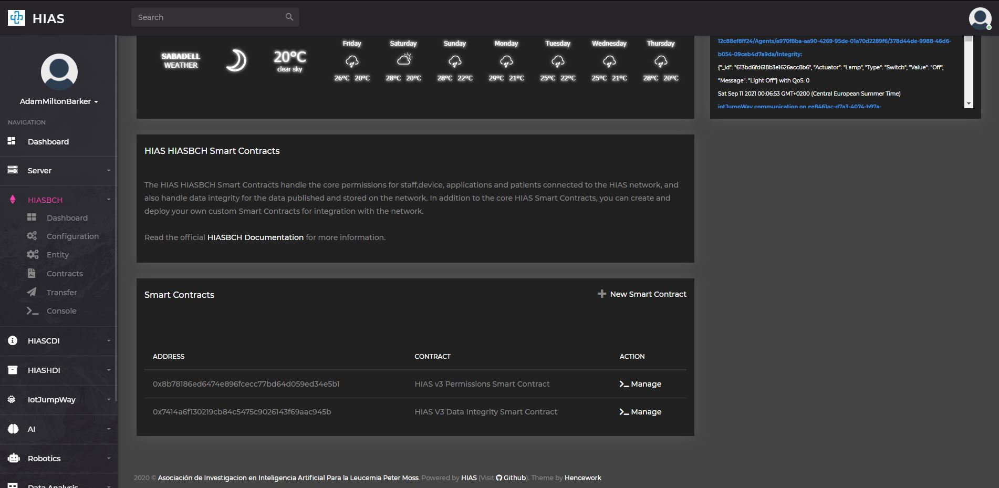
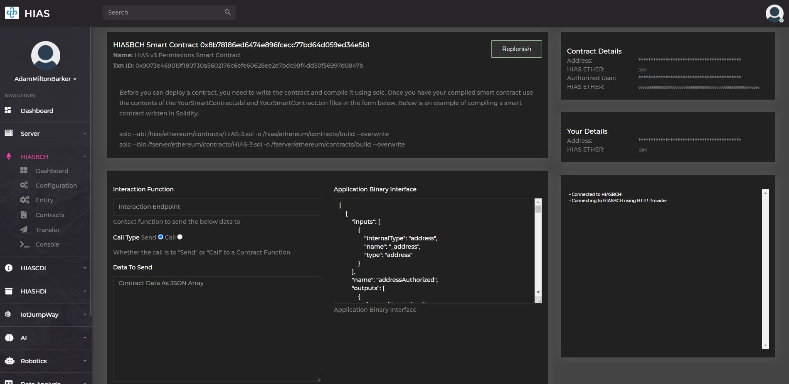

# HIASBCH Usage Guide

The following guide will introduce the [HIAS Core](https://github.com/aiial/hias-core " HIAS Core") HIASBCH management features.

&nbsp;

# Dashboard / Explorer

The HIASBCH UI dashboard is the home page for the HIASBCH Explorer. The HIASBCH component scrapes the block and transaction information from the blockchain and indexes it allowing users to monitor the latest transactions and blocks.

At the top of the dashboard you will see the HIASBCH service information and how to manage it. To the left of the UI is the blocks explorer which allows you to see each block in the blockchain, the time it was mined, the size and which miner was responsible for mining it.

To the right of the UI is the transactions explorer which allows you to see each transaction in the blockchain, the time it was mined, the fee, which miner was responsible for mining it and what address the transaction was sent to.

## Blocks Explorer

Clicking on a block number from the dashboard will take you a page that provides detailed information about that particular block, as well as all transactions related to that block.

## Transactions Explorer

Clicking a transaction hash will take you a page that provides detailed information about that particular transaction.

## Address  Explorer

Clicking an address will take you a page that provides detailed information about that particular address.

&nbsp;

# Configuration

The HIASBCH configuration page allows you to manage the core settings for HIASBCH including connecting the HIASBCH entity, accessing the HIASBCH address and password; and connecting the HIASBCH permissions and data integrity smart contracts.

&nbsp;

# HIASCDI Entity

The HIASBCH HIASCDI entity page allows you to manage the HIASCDI entity settings for HIASBCH. The HIASBCH HIASCDI entity is a JSON representation of the contextual data for HIASBCH. On the left of the page you will find a human readable format of the contextual data for HIASBCH. On the right of the page you will find a JSON format of the contextual data. You can download the HIASBCH credentials file by clicking on the `HIASBCH Configuration` button.

Further down the page to the right you will find easy access to the credentials for HIASBCH. You can reset these credentials using the relevant reset button.

&nbsp;

# Smart Contracts Manager

The HIASBCH smart contracts manager page allows you to manage the smart primary HIASBCH smart contracts. By default you will have two smart contracts: the HIAS v3 Permissions Smart Contract and the HIAS v3 Data Integrity Smart Contract.

Clicking on the manage button for a particular smart contract will take you to the smart contract manager page for that particular smart contract. You can also deploy custom smart contracts to the network using  the manager.

## Smart Contract Management

The smart contract management page allows you to interact with a particular smart contract. As you enter the page the browser will connect to the HIASBCH blockchain and await for interactions from the UI. Using the console you can send a transaction or call a contract as you choose by providing the endpoint you want to interact with and providing any data you want to send. You can also replenish a smart contract if it is running out of HIAS Ether, the core contracts are replenished by the HIASBCH component software but if you have deployed your own custom smart contracts you will need to replenish them manually or update the component code.

&nbsp;

# HIAS Ether Transfer

HIAS Ether powers the entire HIAS network. As HIASBCH is a private Ethereum blockchain the Ether is worthless in the real world, however it is invaluable in the HIAS ecosystem. Staff accounts, applications, and blockchain agents require HIAS Ether to function, they each have their own unique HIASBCH address and as such are capable of holding their own HIAS Ether. The HIAS smart contracts are designed to reward entities that interact with them with HIAS Ether so that they can continue to function, however there may be times where transfers are required. The HIASBCH Transfer UI provides a way to transfer HIAS Ether from the primary account.

# HIASBCH Console

The HIASBCH Console acts in the same way as the HIASBCH Smart Contracts Manager except you have to manually enter the Application Binary Interface (ABI) for the smart contract you want to interact with.

&nbsp;

# Contributing
The Asociación de Investigacion en Inteligencia Artificial Para la Leucemia Peter Moss encourages and welcomes code contributions, bug fixes and enhancements from the Github community.

## Ways to contribute

The following are ways that you can contribute to this project:

- [Bug Report](https://github.com/aiial/hias-core/issues/new?assignees=&labels=&template=bug_report.md&title=)
- [Feature Request](https://github.com/aiial/hias-core/issues/new?assignees=&labels=&template=feature_request.md&title=)
- [Feature Proposal](https://github.com/aiial/hias-core/issues/new?assignees=&labels=&template=feature-proposal.md&title=)
- [Report Vulnerabillity](https://github.com/aiial/hias-core/issues/new?assignees=&labels=&template=report-a-vulnerability.md&title=)

Please read the [CONTRIBUTING](https://github.com/aiial/hias-core/blob/master/CONTRIBUTING.md "CONTRIBUTING") document for a full guide to forking our repositories and submitting your pull requests. You will find information about our code of conduct on the [Code of Conduct page](https://github.com/aiial/hias-core/blob/master/CODE-OF-CONDUCT.md "Code of Conduct page").

You can also join in with, or create, a discussion in our [Github Discussions](https://github.com/aiial/HIASCDI/discussions) area.

## Contributors

All contributors to this project are listed below.

- [Adam Milton-Barker](https://www.leukemiaairesearch.com/association/volunteers/adam-milton-barker "Adam Milton-Barker") - [Asociación de Investigacion en Inteligencia Artificial Para la Leucemia Peter Moss](https://www.leukemiaresearchassociation.ai "Asociación de Investigacion en Inteligencia Artificial Para la Leucemia Peter Moss") President/Founder & Lead Developer, Sabadell, Spain

&nbsp;

# Versioning
We use [SemVer](https://semver.org/) for versioning.

&nbsp;

# License
This project is licensed under the **MIT License** - see the [LICENSE](https://github.com/aiial/hias-core/blob/master/LICENSE "LICENSE") file for details.

&nbsp;

# Bugs/Issues
We use the [repo issues](https://github.com/aiial/hias-core/issues "repo issues") to track bugs and general requests related to using this project. See [CONTRIBUTING](https://github.com/aiial/hias-core/blob/master/CONTRIBUTING.md "CONTRIBUTING") for more info on how to submit bugs, feature requests and proposals.

